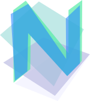
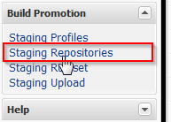
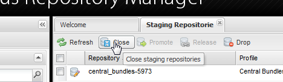

 NEBA  
====

NEBA integrates the Spring Framework into Apache Sling. It makes available all of Spring's features to allow using mature, best-practice solutions for the majority of system-level concerns common to applications based on Apache Sling, such as Adobe AEM. NEBA does so in full compliance with the open core philosophy - using exclusively mature, standardized open source software - [gemini blueprint](http://www.eclipse.org/gemini/blueprint/) - for the integration into OSGi. 

All Spring and Sling features are accessible to developers using a lightweight, [well documented API](http://neba.io/documentation.html) that does not couple the domain -specific implementation code to any implementation details of Sling, Spring or NEBA.

<a href='https://coveralls.io/github/unic/neba?branch=master'></a>  <a href="https://travis-ci.org/unic/neba"></a>

Downloading artifacts
----------------------
NEBA releases are published to maven central. The configuration as well as further information are available at [http://neba.io/download.html](http://neba.io/download.html).

Documentation
--------------------
The project documentation resides at [http://neba.io/](http://neba.io/).

License and included licenses
--------------------
NEBA is licensed under the terms of the Apache License, version 2.0. For the licenses of included products,
see [NOTICE](NOTICE.txt)

Getting support
--------------------
Consult the documentation or ask a question in the site comments at [http://neba.io](http://neba.io), Tweet to [@nebaframework](https://www.twitter.com/nebaframework) ask a question at [Stack overflow](http://stackoverflow.com/) or drop us a mail at neba at unic.com.

Building from source
--------------------
NEBA uses a [Maven](http://maven.apache.org/) based build. invoking

    mvn clean install
    
In the project's root directory will build and install NEBA. We are using [git flow](http://nvie.com/posts/a-successful-git-branching-model/),
yo you might want to do so on the "develop" branch.

Releasing NEBA
--------------------

### Summary
NEBA is released using the [maven jGitFlow plugin] (https://bitbucket.org/atlassian/jgit-flow/wiki/Home). Releasing requires modification rights for the neba github repository and the ability to sign and upload the artifacts to the sonatype OSS staging repository. Finally, the release must be accompanied by a release notes blog post published via the gh-pages branch and an announcement on Twitter. 

###Prerequisites

To release NEBA, credentials for the sonatype [OSS repository](https://oss.sonatype.org/content/repositories/) are required, and must be configured in the maven settings.xml, like so:

````
 <server>
   <id>ossrh</id>
   <username>...</username>
   <password>...</password>
 </server>
````

In addition, a GPG installation executable from the [maven-gpg-plugin](https://maven.apache.org/plugins/maven-gpg-plugin/) must be installed on the local system, e.g. [GPG4Win](https://www.gpg4win.org/) on windows. As the delivery artifacts are signed, you require a valid key pair, and the public key must have been [distributed to a public key server](https://www.gnupg.org/gph/en/manual/x457.html).
 
Furthermore, JDK 1.8 is required for building and releasing NEBA.
 
### Write a release post for the neba.io site
In a separate clone of the neba.io git repo, checkout the gh-pages branch and write a release post, such as https://github.com/unic/neba/blob/gh-pages/_posts/2016-01-22-neba-release-3.9.0.html. Testing the site locally requires running Jekyll including pygments for and Python 2.x for code highlighting, see http://jekyllrb.com/docs/installation/.

### Perform the release
Invoke

    mvn -Prelease jgitflow:release-start
 
and enter the desired release version. We are using the versioning scheme x.x.x, e.g. "4.10.1". All artifacts must have the same release version.

Then, invoke

    mvn -Prelease jgitflow:release-finish

Resulting, the artifacts are pushed to the sonatype OSS staging repository

### Test staged release artifacts

Login to https://oss.sonatype.org/ and select "Staging Repositories". 




In the list of repositories, select the io-neba staging repo. Download the AEM and Sling deliveries and test them on the local system by installing them and testing that
all contained bundles are started properly.

Then, browse the remaining artifacts (e.g. api, core) in the repository and make sure that the jar, source-jar and javadoc-jar artifacts are present.

### Release the staged repository
In https://oss.sonatype.org/, select the tested neba staging repository and click "close".



 
This triggers an automated workflow testing the repository for compliance. Once this process has finished (after a few minutes), click on "Release".

### Push the release
On you local system, push the *develop* and *master* branch as well as the tags, e.g. using

    git push --tags
    
### Publish the release blog post
simply push the new blog post on the gh-pages branch - the neba.io site is updated automatically. 

### Publication on twitter
Publications are announced via the official [@nebaframework](https://twitter.com/nebaframework) twitter channel and must contain the tag #nebaframework. Tweets with this tag are automatically featured on the neba.io home page.
    